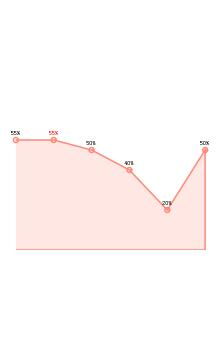
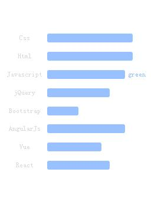

# Component Dev
基于jQ, 使用fullpage插件的一套组件式开发模板。

使用其可以完成绝大部分的fullpage应用。

提供各类图表组件，简单易操作。

### Component_Dev有哪些功能？
* 简单轻便的配置方式
* 内置详细易懂的代码注释
* 支持手动增加各类配置文件
* 内置雷达图、折线图、饼图、柱图、散点图组件
* 基于整屏插件fullpage，实现整屏滑动功能
* 强大的`自定义CSS`功能，方便定制自己的展示

### Component_Dev 基础图例





### 调用方法
* 基础插件js与css

```html
	<link rel="stylesheet" href="../css/content_organize.css">
	<link rel="stylesheet" href="../css/componentBase.css">
	<script type="text/javascript" src="../lib/jquery.js"></script>
	<script type="text/javascript" src="../lib/jquery-ui.min.js"></script>
	<script type="text/javascript" src="../lib/jquery.fullPage.js"></script>
	<script type="text/javascript" src="../js/content_organize.js"></script>
	<script type="text/javascript" src="../js/componentBase.js"></script>

```
* JS脚本 (addPage方法增加页面，addComponent方法增加组件)
* 注：需要new H5对象之后再使用Component_Dev

```javascript
	$(function(){
			var h5 = new H5();
			h5.addPage('page-1')
					.addComponent('logo',{
						text:'logo',
						width: 400,
						height: 100,
						center: true,
						class: 'logokiss',
						css:{
							background:'grey',
							top:  200,
							opacity: 0
						},
						animateIn : {opacity:1},
						animateOut : {opacity:0}
					})
					.addComponent('slogan',{
						text:'slogan',
						width: 400,
						height: 100,
						center: true,
						css:{
							background:'grey',
							top:  400,
							opacity: 0
						},
						animateIn : {opacity:1},
						animateOut : {opacity:0}
					})
				.loader();
		});
```

###有问题反馈
在使用中有任何问题，欢迎反馈给我，可以用以下联系方式跟我交流

* 邮件  (1932880704@qq.com, SawyerJames@gmail.com)
* QQ: 1932880704
* twitter: [@SawyerJames](http://twitter.com/SawyerJames)

###关于作者
* [SawyerJames](https://github.com/SawyerJames)